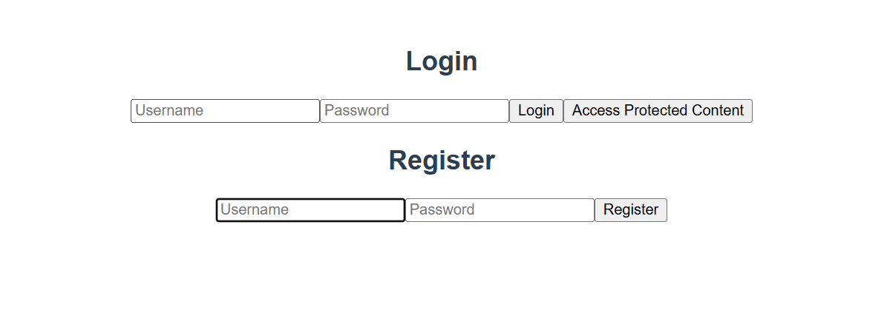

# JWT-Based Authentication with Flask and Vue.js

This is a simple web application demonstrating JWT-based authentication with a Flask backend and a Vue.js frontend. Users can register, log in, and access protected content that requires a valid JWT token.

## Project Structure

project-root/ ├── backend/ # Backend (Flask) │ ├── app.py # Main application file │ ├── requirements.txt # Python dependencies │ └── venv/ # Python virtual environment └── frontend/ # Frontend (Vue.js) ├── public/ ├── src/ │ ├── components/ │ │ └── LoginAuth.vue # Main Vue.js component for authentication │ └── App.vue # Root Vue.js component ├── package.json # Node.js dependencies └── README.md # Frontend-specific README (optional)


## Features

- **User Registration**: Allows new users to register with a username and password.
- **User Login**: Authenticates users and returns a JWT token.
- **Protected Content**: Access to certain API endpoints is restricted to authenticated users with a valid JWT token.
- **RBAC & ABAC**: Restrict access based on user roles and attributes.

## Prerequisites

- **Python** (for the backend)
- **Node.js** and **npm** (for the frontend)
- **MongoDB** running locally on `mongodb://localhost:27017`

## Getting Started

### Backend Setup (Flask)

1. **Navigate to the backend directory:**
   ```bash
   cd flask-backend

2. **Set up a virtual environment and install dependencies::**
   ```bash
    python -m venv venv
    source venv/bin/activate  # On Windows, use `venv\Scripts\activate`
    pip install -r requirements.txt

3. **Start MongoDB (if not already running): Make sure MongoDB is running on**
   ```bash
        Start MongoDB (if not already running): Make sure MongoDB is running on mongodb://localhost:27017 or update the MongoDB URI in app.py.
4. **Run the backend server:**
    ```bash
    python app.py

## Frontend Setup (Vue.js)

1. **Navigate to the frontend directory:**
   ```bash
   cd vue-frontend

2. **Install dependencies:**
   ```bash
   npm install

3. **Run the frontend server:**
   ```bash
    npm run serve



## API Endpoints

1. **Register: POST /register**
    ### Endpoint: http://127.0.0.1:5000/register
    ### Description: Register a new user.
    ### Body:
        json
        
        { "username": "<username>", "password": "<password>" }
    ### Response:
        201 Created on success
        409 Conflict if the username already exists.
2. **Login: POST /login**
    ### Endpoint: http://127.0.0.1:5000/login
    ### Description: Login with an existing user and receive a JWT token.
    ### Body:
    json
    { "username": "<username>", "password": "<password>" }
    ### Response:
    Success: { "access_token": "<token>" }
    Failure: 401 Unauthorized
2. **Protected Content: GET /protected**
    ### Endpoint: http://127.0.0.1:5000/protected
    ### Description: Access protected content that requires authentication.
    ### Headers:
    json
    { "Authorization": "Bearer <token>" }
    ### Response:
    ### Success: Returns protected content if the token is valid.
    ### Failure: 401 Unauthorized if the token is invalid.

## Extending with RBAC and ABAC

### 1. Role-Based Access Control (RBAC)
**Objective**: Assign roles (e.g., admin, user, editor) to users and restrict access to endpoints based on roles.

#### Backend Changes:
- **Define User Roles**:
  ```json
  {
    "username": "mahmoud",
    "password": "hashed_password",
    "role": "admin"
  }
- **Assign Roles:**
    During user registration, allow a role to be assigned or set a default role (e.g., user) if no role is provided

- ### 2.Attribute-Based Access Control (ABAC):
**Objective**: Grant or restrict access based on specific user attributes or environmental conditions (e.g., age, department, time of request).
  ```json
  {
    "username": "mahmoud",
    "password": "hashed_password",
    "role": "admin",
    "department": "R&D"
  }
